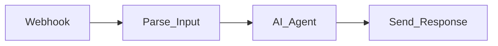

# Workflow Documentation SOP

## Objective
Auto-generate comprehensive markdown documentation for all n8n workflows, maintaining an up-to-date catalog and individual workflow reference docs.

## Prerequisites
- n8n API key configured
- Active workflows deployed on n8n instance

## Running Documentation Generation

```bash
python tools/run_manager.py docs
```

### What It Generates

1. **Workflow Catalog** - Master table of all workflows (active and inactive)
2. **Individual Docs** - Detailed markdown for each active workflow

## Catalog Format

The catalog (`workflow_catalog.md`) includes:

```markdown
# n8n Workflow Catalog

**Generated:** 2025-02-01 | **Total:** 45 | **Active:** 32 | **Inactive:** 13

## Active Workflows
| # | Name | ID | Nodes |
|---|------|----|-------|
| 1 | Lead Qualifier Bot | abc123 | 12 |
| 2 | WhatsApp Agent | def456 | 8 |
...

## Inactive Workflows
| # | Name | ID | Nodes |
...
```

## Individual Workflow Doc Format

Each workflow doc includes:

### Header
- Workflow name, ID, status (Active/Inactive)
- Node count, creation date, last updated

### Triggers
- What triggers the workflow (webhook, schedule, manual, etc.)

### Node Inventory
- Numbered table of all nodes with their types

### AI Components (if applicable)
- AI nodes with model information

### Data Flow
- Mermaid diagram showing node connections:


## Output Files

| File | Location | Contents |
|------|----------|----------|
| Catalog | `.tmp/workflow_catalog.md` | Master workflow inventory |
| Individual docs | `.tmp/workflow_docs/<name>.md` | Per-workflow documentation |

## When to Regenerate

- After deploying new workflows
- After modifying existing workflow structure (adding/removing nodes)
- Before audit or compliance reviews
- When onboarding new team members
- Monthly, as part of regular maintenance

## Using Documentation for Onboarding

Share the generated docs with new team members:

1. Start with `workflow_catalog.md` for the full inventory
2. Review individual docs for workflows they'll be responsible for
3. Use the Mermaid diagrams to understand data flow
4. Cross-reference with the sibling project (`../n8n Agentic Workflows/`) for raw JSON definitions

## Customizing Documentation

The `WorkflowDocsGenerator` class in `tools/workflow_docs_generator.py` can be extended:

- Add custom sections by modifying `generate_workflow_doc()`
- Filter workflows by category in `generate_full_catalog()`
- Change output format (currently markdown with Mermaid)

## Best Practices

1. **Automate generation** - Run `docs` mode after every deployment
2. **Version control** - Commit generated docs to git for history tracking
3. **Review AI sections** - Verify model names and parameters are accurate
4. **Keep catalog current** - Stale docs are worse than no docs
5. **Link to SOPs** - Reference relevant SOPs from workflow docs for operational context
